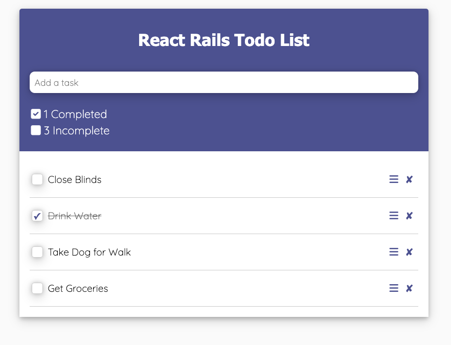
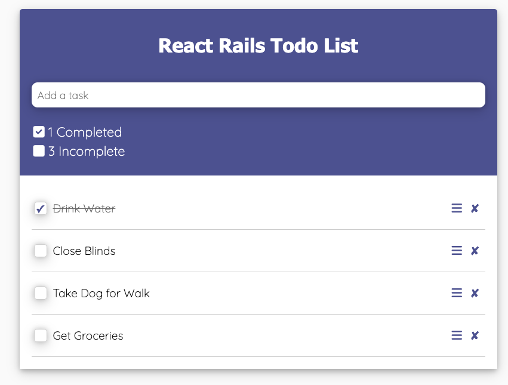
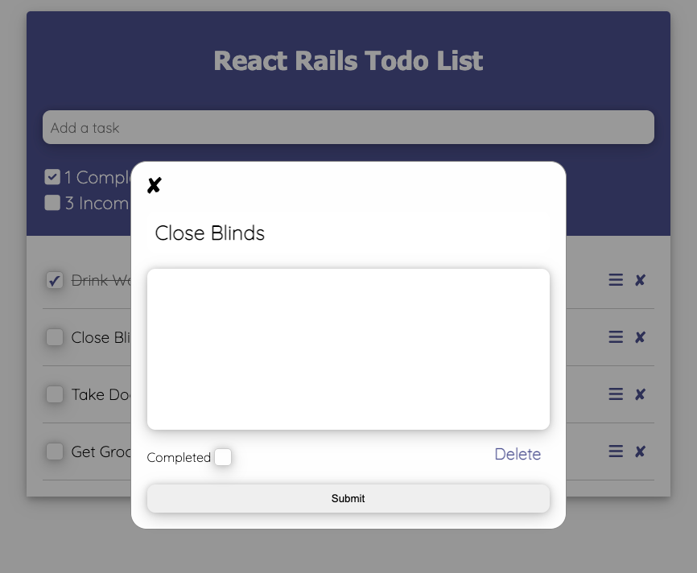

# React-Rails-Todos

<p align="center">
  
  <h1 style="text-align: center;">Server Side Rendered React Todo App using Ruby on Rails</h1>
</p>


# Inspiration

What a better way to learn about a technology than to learn by creating a todo app. Making the todo app was fun deploying it to heroku was not. But I prevailed. Checkout the deploy here <a href="https://todos-react-rails.herokuapp.com/" target="_blank">React Rails Todos</a>


# Features

- Add Todo
- Edit Todo
- Delete Todo
- View Todo
- Change order of Todos via Drag n Drop
- Fully Functional Desktop and Mobile


# Installation

First clone this repo

```shell
git clone git@github.com:livingkurt/React-Rails-Todos.git
```


Inside of the repo directory

Install node_modules

```shell
npm install
```

Install Gems

```shell
bundle install
```

Update .env file with your Postgres server password

```shell
REACT_RAILS_TODOS_DATABASE_PASSWORD=
```

Initialize your Local Database

```shell
rake db:create
```
Migrate your database

```shell
rake db:migrate
```

Start up your app

```shell
rails s
```

# Technology

- React
- react beautiful dnd
- immutability-helper
- Ruby on Rails
- React Rails
- PostgreSQL
- Axios
- sass

# Pictures

<div align="center" style="display:flex; flex-direction: column; flex-wrap: wrap;">
<div>
  <h2>Main Page</h2>
  
  <h2>Drag n Drop Todos to change order</h2>
  
  <h2>Add a Description</h2>
  
</div>
</div>